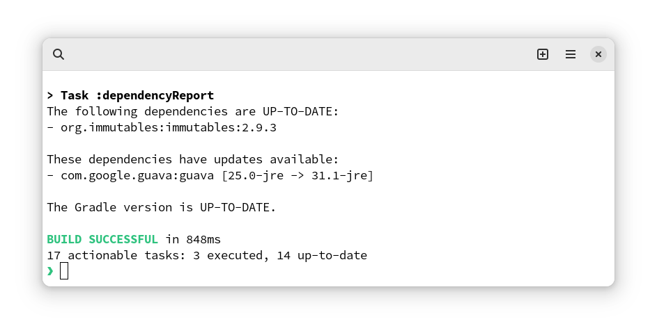

<div align="center">
<h1> Dependency Report Plugin</h1>
<p>

[](https://github.com/beatbrot/gradle-dependency-report/actions/workflows/gradle.yml)[](https://gradle.org) [](https://mit-license.org/)

</p>
<p>
Keep your dependencies updated and secure with this Gradle plugin.
</p>

<picture>
    <source media="(prefers-color-scheme: dark)" srcset=".github/media/screenshot-dark.png">
    <source media="(prefers-color-scheme: light)" srcset=".github/media/screenshot-light.png">
    
</picture>

</div>


---

## Installation

Add the following line to your `build.gradle` file:

```kotlin
plugins {
    id("io.github.beatbrot.dependency-report") version "0.1.0"
}
```

## Features

- Create reports of your project dependencies and available updates
- Supports [Configuration cache](https://docs.gradle.org/current/userguide/configuration_cache.html)
- Does not use deprecated or internal Gradle API
- No runtime dependencies
- Compatible with Gradle 6 to 8

## Usage

Run the command `gradle dependencyReport` to generate a report of your project's dependencies and their update status.
The report will be printed to console and saved at `build/reports/dependencies.txt`

## License

This project is licensed under the MIT license. See the [LICENSE](LICENSE) file for more information.
